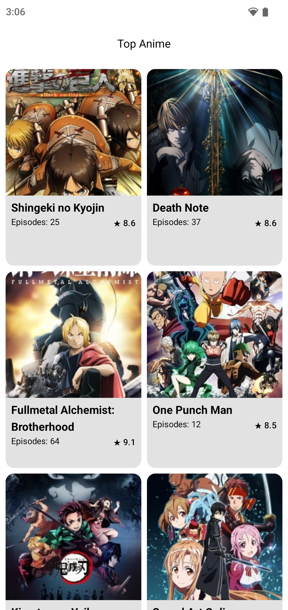
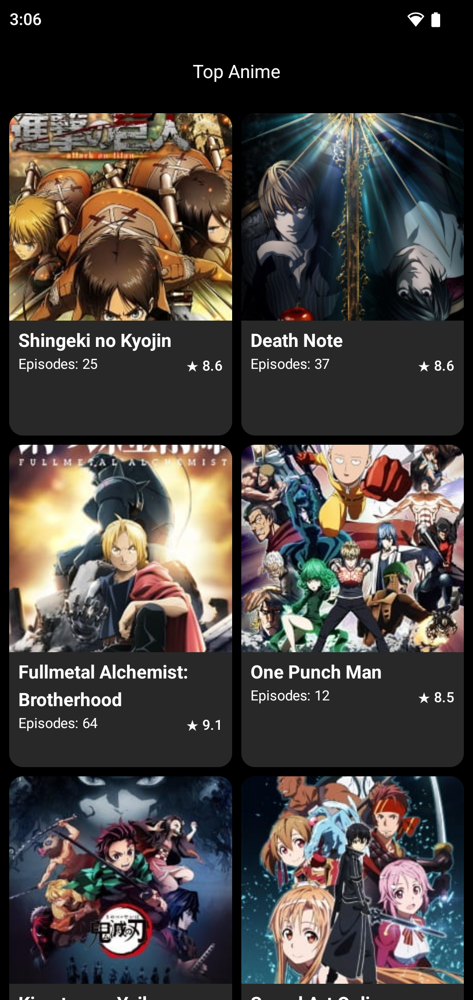
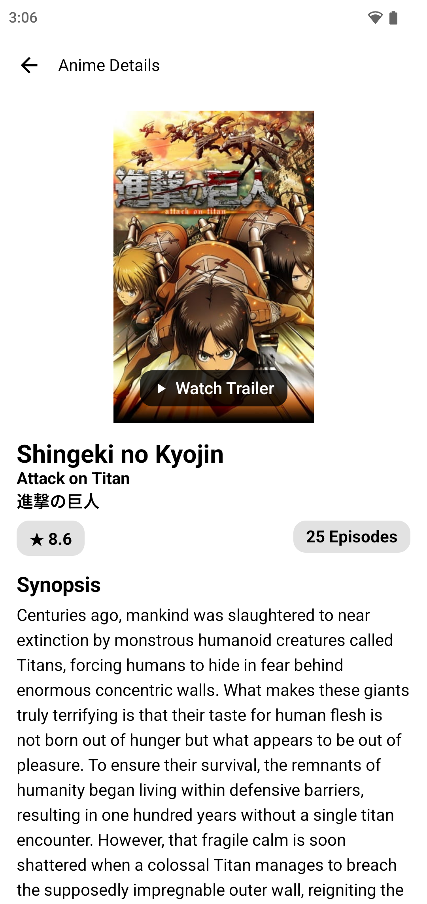
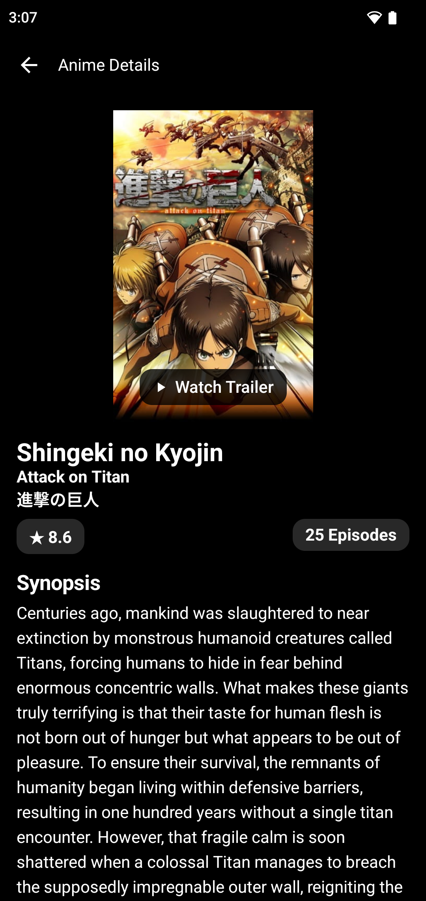
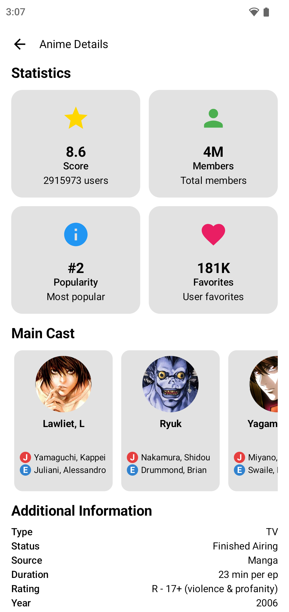
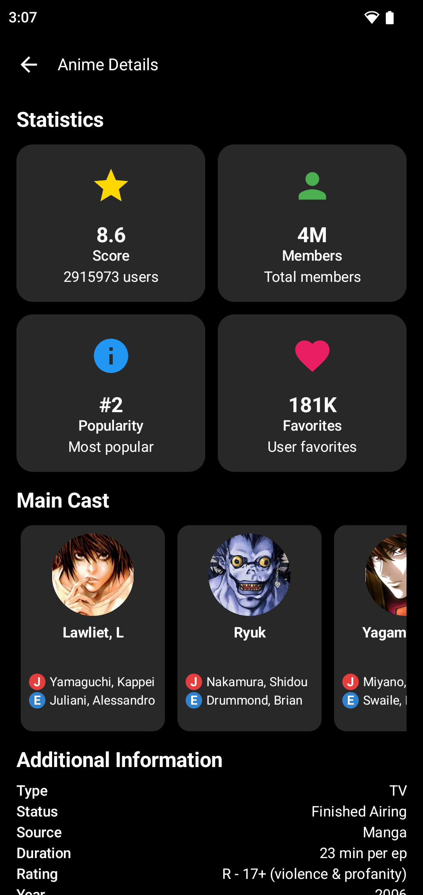
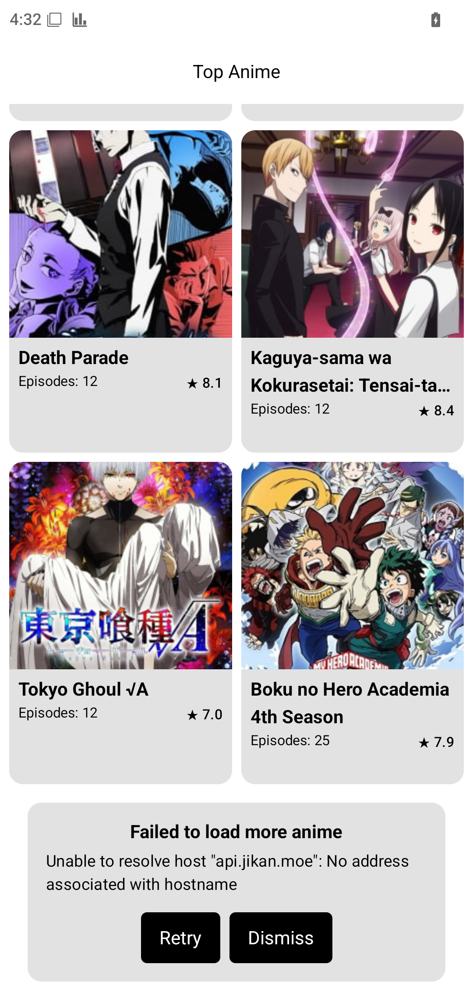
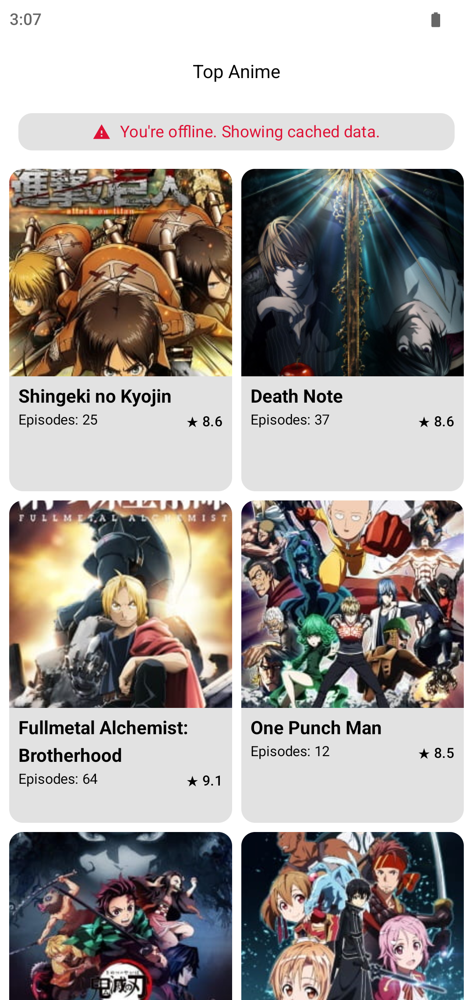
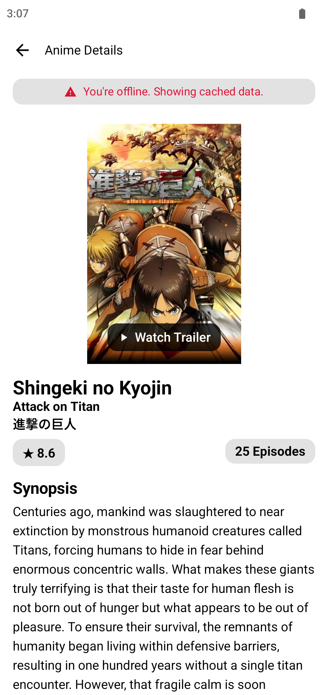

# Jikan Anime App

A modern Android app that fetches and displays anime data using the Jikan API with offline support.

## Features

- **Anime List** - Browse top anime with pagination
- **Anime Details** - View complete information including trailers
- **Offline Mode** - Works without internet connection
- **Local Database** - Room database for caching
- **Error Handling** - Graceful error management
- **Network Monitoring** - Real-time connectivity status
- **Design Constraint Handling** - Dynamic image visibility control

## Tech Stack

- **Architecture**: MVVM with Repository Pattern
- **UI**: Jetpack Compose
- **DI**: Hilt
- **Networking**: Retrofit + OkHttp
- **Database**: Room
- **Images**: Glide
- **UI Components**: Lumo Design System

## Screenshots

### Main Features

| Feature                  | Light Theme                                                          | Dark Theme                                                         |
| ------------------------ | -------------------------------------------------------------------- | ------------------------------------------------------------------ |
| **Anime List**           |                        |                        |
| **Anime Details**        |                |                |
| **Anime Details Bottom** |  |  |

### Error States & Offline Mode

| State               | Screenshot                                                    |
| ------------------- | ------------------------------------------------------------- |
| **Network Error**   |                     |
| **Offline Mode**    |          |
| **Offline Details** |  |

## API

Uses [Jikan API](https://jikan.moe/) for anime data:

- Top anime list
- Anime details
- Character information

## Architecture

```
├── UI Layer (Compose + ViewModels)
├── Repository Layer (Data Management)
├── Data Layer (API + Local Database)
└── Network Layer (Retrofit + Room)
```

## Key Components

- **AnimeListScreen** - Grid layout with pagination
- **AnimeDetailScreen** - Complete anime information
- **AnimeRepository** - Data synchronization logic
- **NetworkMonitor** - Connectivity management
- **Room Database** - Local caching

## Offline Support

- Caches anime data locally
- Syncs when network available
- Handles stale data refresh
- Graceful fallback to cached content

## Design Constraint Handling

**Image Visibility Control** - Demonstrates capability to handle legal constraints:

- `ImageFlags` system for dynamic image display control
- Can hide anime posters, character images, trailer thumbnails
- Maintains layout integrity when images are disabled
- **Note**: This is a demonstration feature. In production, such controls would be managed by backend configuration.

## Assumptions Made

1. **API Stability** - Jikan API structure and rate limits remain consistent
2. **Network Behavior** - Users have intermittent connectivity, offline-first approach preferred
3. **Memory Management** - 300 anime items max prevents memory issues on mobile devices
4. **Data Freshness** - 1-hour cache threshold balances performance vs. data currency
5. **User Experience** - YouTube redirects and gradient fallbacks are acceptable UX patterns

## Known Limitations

- **Video Playback**: Trailers redirect to YouTube app/browser for playback
- **API Rate Limits**: Jikan API has rate limiting (3 requests/second)
- **Image Caching**: Images are cached by Glide but not persisted across app restarts
